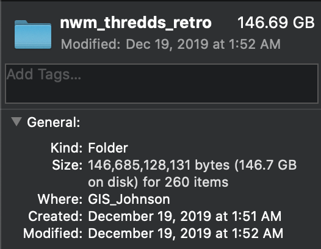

---
title:
output:
  html_document:
    toc: true
    toc_float: true
    theme: united
    highlight: tango
---

```{r setup, include=FALSE}
knitr::opts_chunk$set(echo = TRUE)
```

## `r Sys.Date()`

Dear Hydroinformatics Committee, 

Thank you for taking the time to follow up and allowing me to clarify these points. I hope the following document helps clarify and ease any concern about what we hope to accomplish under this project.
___________________________

# Question 1. 
**In the cover letter it’s implied that one of the project deliverables will be “Providing CUAHSI/RENCI with a THREDDs/OPeNDAP archive of the NWM v2.0 reanalysis product”, but this isn’t directly communicated in the deliverables on page 5. Instead it’s stated that “scripts and configurations to download and format a stable archive” will be provided. Please clarify specific deliverables.**

I apologize for the confusion here. We will be providing CUAHSI/RENCI with the formatted data from the version 2.0 reanalysis run *AND* the scripts and configurations to build analogous datasets for future runs (e.g. v2.1, 2.2, 3.0). The end goal is to provide sustainable support (storage, access/retrieval, and visualization) for the most current NWM reanalysis product. For now, the data we provide offers just this but eventually it will be outdated and we want to ensure that transition is painless.

In the proposal (page 5) this is point 2 in the Winter Quarter expectations but wasn't made explicit in the five bullet points as it should have been.

# Question 2:

**The proposal requests 200GB of disk space on RENCI servers but is not budgeted for and no letter of commitment has been provided by RENCI. Can you provide a letter from RENCI committing these resources?**

As we are a bit latter in time I can now confidently say the needed space is 147 GB as be seen below. 

{width=250px}

Per this request, I am working on getting an official letter of support and will pass that along ASAP. I have talked with Jeff Horsbourgh and we believe we can get this letter secured through the team members (David Tarboton, Jared Bales) of the Urban Flooding Open Knowledge Network Project (another large project in which CUAHSI is a central member) if not directly through RENCI then through other means (e.g. the Hydroshare storage allocation) or another service.

While our **strong** preference is to host the data at RENCI to provide harmony between the operational and historic products under the umbrella of CUAHSI data services, the size needed is not so prohibitive that we cannot find an alternative if need be.

# Question 3:
**The budget states that $300.00 will be used for the testing and deployment of software on AWS. This number seems low without a detailed justification. Can you provide a list of the AWS services that will be used and their respective costs?**

This estimate is based on our experience developing and deploying [FlowFinder](https://mikejohnson51.github.io/FlowFinder) on Amazon Web Services (AWS). The expense reports for the last 6 months of running this application can be seen below:

```{r, echo=FALSE}
tab = read.csv('./data/costs.csv') 
DT::datatable(tab, colname = trimws(gsub("\\.", " ",names(tab))), 
              filter = "none")
```

Currently no monthly cost has exceeded $15. As such, our estimate for $300 was based on running 2 identical EC2 instances (to test different features, stability, and options) for 8-10 months before launching the "official" single application. 

# Question 4: 

**Given preliminary work we’ve done at CUAHSI to expose AWS data via THREDDs, we discovered that there can be significant network lag when accessing data that’s stored by different providers. I’m concerned that the proposed work of storing data at RENCI and building web applications in AWS may introduce network lag that would necessitate moving all data to AWS, which would increase costs significantly. Has any preliminary work been done to test that the proposed design pattern will work?**

The design pattern for this proposal has been well tested in many areas including streaming vector data from the USGS geoserver; time series data from the RENCI archive of NWM model output; and climate rasters from the USGS CIDA and University of Illinois THREDDS servers into local and cloud-based sessions and Shiny instances. This is facilitated by techniques we have developed and formalized in a number of existing R packages ( [nwm](https://github.com/mikejohnson51/NWM), [HydroData](https://github.com/mikejohnson51/HydroData), [climateR](https://github.com/mikejohnson51/climateR)).

The workflow relies on three intentionally developed products. The first is a THREDDS accessible archive - chunked by feature rather then time - to be hosted via HydroShare/RENCI or anther THREDDS server. The second is a R package that serves as an API for retrieving and formatting this data within a working R session and the final product is an R Shiny application (that will also be delivered as an R package) that assists with things such as COMID discovery, mapping and interactive plotting. 

To deploy this application we will follow the practices discovered with FlowFinder   (setting up an Amazon EC2-instance with R and Shiny Server installed). In approaching the problem this way, there is no difference between streaming data to the Shiny instance, or a local R session, and consequently, no additional lag is seen then what is experienced locally. To show this, please see three mini-Shiny apps that pull data requests of various sizes into a Shiny Application from local and web-based resources.

The coded examples are archived [here](https://github.com/mikejohnson51/cuahsi_example_shiny_apps) for your convenience:

Note that in all examples, the time listed in the plot titles is the time it takes to:

  1) start R, 
  2) load the needed packages,
  3) initialize Shiny Browser
  4) retrieve the data, 
  5) plot it,
  6) render it. 
  
In a number of samples I found the first three of these took ~2 seconds.

### Example 1) 
In this example we access a local copy (non-final) of the data we are proposing to make public and retrieve and plot the entire time series for an single COMID.

{width=550px}

### Example 2) 

In this example we do the same thing but instead retrieve data from a private development THREDDS server hosted by the USGS. Note that only a fraction of second is added by querying the data from the web then from the local resource.

{width=550}


### Example 3) 
To illustrate that most THREDDS servers respond similarly, and the capacity for the APIs we develop to interact with multiple resources, we show a request for a climate dataset hosted at the University of Illinois for the 4km precipitation grid over North Carolina on Oct 29, 2019. Again, we see the retrial time is minimal.

{width=550px}

### Example 4)

Lastly, to illustrate a fall back if we are unable to cooperate with RENCI, directly we uploaded a sample of the NWM archive to HydroShare as a public resource taking advantage of the automated iRODS THREDDS server.

The resource is uploaded [here](https://www.hydroshare.org/resource/49a53c2f0606458e90b0e219232fa424/) and can be accessed through a web call using the associated resource ID 49a53c2f0606458e90b0e219232fa424.

{width=550px}

While the response here is slower then other resource dedicated THREDDS servers, it showcases the fact this project will be able to move forward on it own standing.

The main take away of these examples is that the retrieval of data in this design workflow is resilient to where data is stored and to some level the number of values requested. This testing, along with our experience with FlowFinder give us great confidence that our design process works for this type of retrial/visualization work and we have the techniques needed to avoid excess lag while capitalizing on the opportunities of bring together datasets stored by different providers.

# Question 5:
**Will Dave Blodgett be acting as an independent consultant? We cannot pass money to the USGS.**

Dave Blodgett will be acting outside of his official USGS obligations and will be compensated for his time by me (via earmarked values in the grant).


___________________________

I hope this document helps ease any concerns you have with the project and provides comfort in the feasibility. As mentioned in the proposal the tools needed to execute this work are already in place but need to be polished and integrated. The funding of this project will free up some of my teaching obligations to do just this and ultimately yield a robust community resource for accessing and applying NWM data to research and operations under CUAHSIs umbrella. 

Thank you again for the opportunity to add this supplementary information and if there are any remaining concerns please let me know,


**Mike Johnson**


